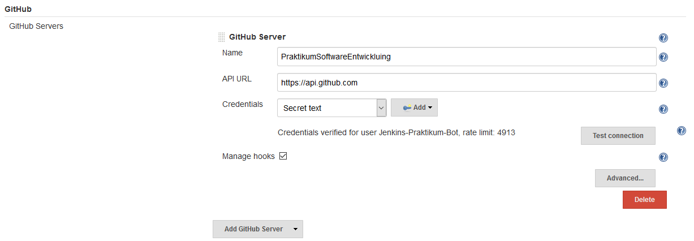
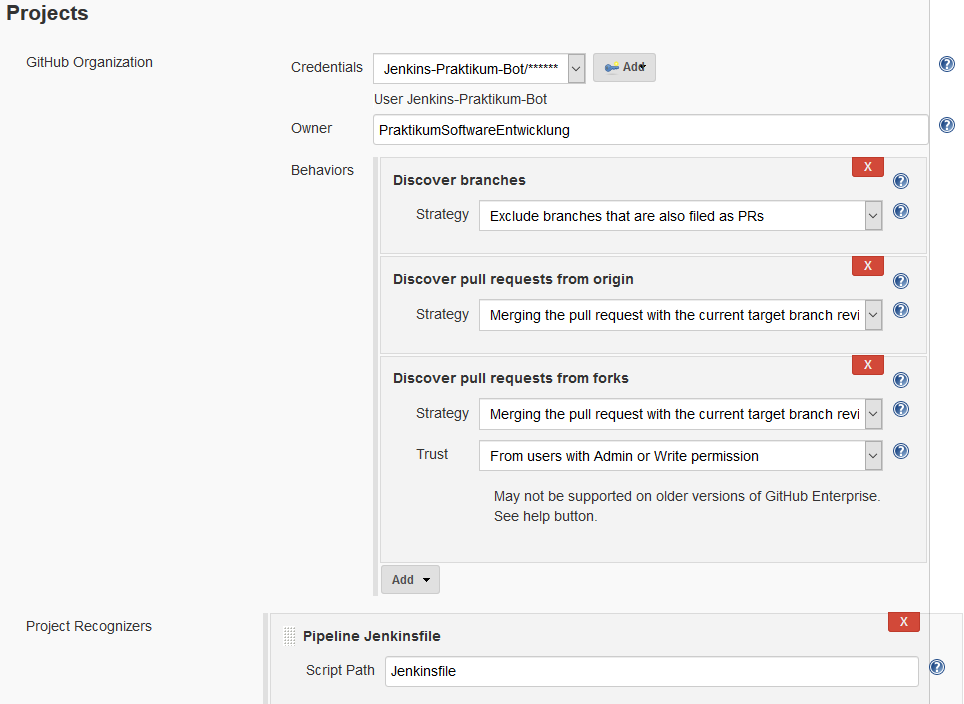

## Installed Plugins

* GitHub Authentication plugin- enabling login with your Github Acount
* GitHub Integration plugin - enabling the automated CI workflow
* Blue Ocean - for a modern UI
* Checkstyle - Code Analysis
* Jacoco - Java Code Coverage Plugin
* Email Extension - to send Email Notifications

## Add Github Organization

Go to new Item > Github Organization and type in a name. Afterwards fill in all the required fields as shown below. Be aware not all fields are mentioned only the not obvious ones.

## Setup Github Server

Go to Manage Jenkins > Configure Systema and add the required Github Server. As Credentials put in a generated access token from a Github User which is an Admin. This is necessary in order to be able to manage the webhooks.



## Configuration Oauth Login and Access Control

Go to manage Jenkins > Configure Global Security and activate the 'Global GitHub OAuth' Settings
Put in your values and credentials as seen in the screenshot. Do not forget to set an Admin!


more Details [here](https://wiki.jenkins.io/display/JENKINS/Github+OAuth+Plugin)

## Project Settings

In your Project go to Configure and the following settings for branch and pull request Detection.



## Pipeline Library for a Project

If you want to use a shared Library for your Project go in your Project to configure and set the Pipeline Library Settings.


To use is simply put the library in your jenkinsfile.

```groovy
@Library('SharedLibrary') _
buildPipeline() //example call
```
more information [here](https://jenkins.io/doc/book/pipeline/shared-libraries/)

## Email Notification

In order to send build notifications, you have to configure a SMTP server to send mails. We use a free mail server hosted ad Zoho. In order to use it, you have to specify the following information with `EMAIL` and `PASSWORD` being placeholders:
* Configure System > Jenkins Location > System Admin e-mail address: EMAIL
* Configure System > Extended E-mail Notification
  * SMTP server: smtp.zoho.eu
  * Use SMTP Authentication: true
  * User Name: EMAIL
  * Password: PASSWORD
  * Use SSL: true
  * SMTP port: 465
